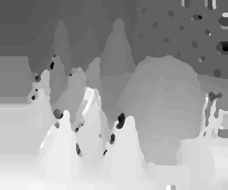

# ROB501: Computer Vision for Robotics

## Assignment 3: Stereo Correspondence Algorithms

### Fall 2024

---

### Overview

Stereo vision is crucial for many robotics tasks as it provides dense depth and appearance information. To recover depth accurately from stereo images, a correspondence or matching problem must be solved for each pixel. This process generates a disparity map, translating pixel differences to inverse depth values. In this assignment, you will experiment with dense stereo matching algorithms to:

- Understand stereo block matching and the complexities of block-based processing.
- Gain experience with more advanced methods for stereo depth estimation.

The algorithm we use uses a very simple line search for the best match (using a sum-of-absolute-difference metric) over a small window. Despite its simplicity, it provides decent results after some simple filtering.

Example data and ground truth
| left | right | ground truth | our output |
|-|-|-|-|
| |  |  |  |


### Submission Details

- **Due Date**: Monday, November 11, 2024, by 11:59 p.m. EDT
- **Submission Platform**: Autolab
- **Programming Language**: Python 3
- Multiple submissions are allowed until the deadline.

Your implementation must adhere to the provided templates and include clear comments. Submissions will be tested for accuracy, efficiency, and clarity.

---

### Tasks Overview

1. **Part 0: Your Secret Identifier**
   - Create a function in `secret_id.py` that returns a polite secret ID string (max 32 characters). This ID will be used on the leaderboard tracking Part 2 performance.

2. **Part 1: Fast Local Correspondence Algorithms**
   - Implement a simple stereo correspondence algorithm using a fixed window size and the Sum of Absolute Differences (SAD) similarity measure.
   - Match pixels with a winner-take-all strategy and ensure your function handles bounding boxes and maximum disparity constraints.
   - Evaluate performance using the provided RMS error function and compare your disparity maps against ground truth data from the Middlebury Cones and Teddy datasets.

3. **Part 2: A Different Approach**
   - Develop and implement an alternative stereo correspondence algorithm, such as one using global information or an alternative local matching technique.
   - Aim to exceed the performance of your Part 1 implementation, evaluated using the RMS error and percentage of correct disparities.

### Datasets

You will use stereo image pairs from:

- **Middlebury Stereo Vision Repository**: Includes rectified images like the Cones and Teddy datasets, along with ground truth disparity maps.
- **KITTI Dataset**: Features real-world stereo images with larger disparity values.
- **Mars Rover Stereo Imagery**: Optional; real stereo images captured by the MER Spirit rover. Ground truth is not available.

---

### Submission Checklist

- [ ] `secret_id.py`
- [ ] `stereo_disparity_fast.py`
- [ ] `stereo_disparity_best.py`

```
tar cvf code.tar secret_id.py stereo_disparity_best.py stereo_disparity_fast.py stereo_disparity_score.py
```

Include clear comments and ensure compatibility with the Autolab testing suite. Be concise and accurate, and ensure your code runs within the specified runtime limits.

### Resources

1. Szeliski’s Textbook (Sections on Stereo Vision and Disparity Computation)
2. Middlebury and KITTI Dataset Documentation
3. Optional: Scharstein’s Paper on Stereo Matching Techniques (2002)

